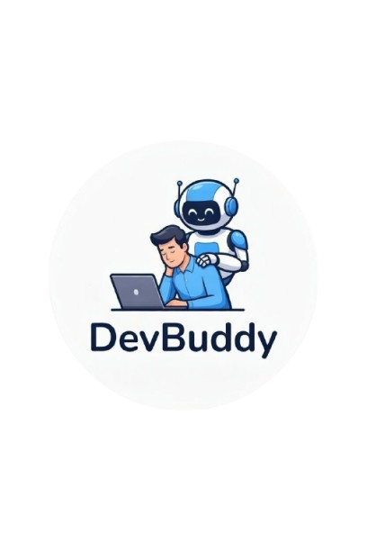

<div align="center">
  
  
  # DevBuddy 🚀
  
  **A Friendly AI Assistant for Developers**
  
  [](https://www.python.org/)
  [](https://flask.palletsprojects.com/)
  [](https://opensource.org/licenses/MIT)
  [](https://groq.com/)
  [](https://developer.mozilla.org/en-US/docs/Web/JavaScript)

  **🏆 IIMS VIBEATHON 2026 WINNER 🏆**
  
  **DevBuddy** is a friendly AI assistant platform that helps developers when they are tired or stuck with code. It focuses on your well-being and productivity by combining task management, coding challenges, AI chat support, and health reminders.
  
</div>

## Features

- ✅ **Task Manager with Timer** - Focus on one task at a time with built-in Pomodoro timer
- 🧠 **AI Chatbot** - Chat with Buddy AI for coding help and support (powered by Groq)
- 💪 **Code Challenges** - Generate beginner-friendly Python coding challenges
- 😄 **Meme Generator** - Take a break with random memes
- 💧 **Health Reminders** - Hydration, posture, and eye care reminders
- 💾 **Local Storage** - All tasks and chat history persist in your browser

## Tech Stack

- **Frontend**: HTML, CSS (TailwindCSS), Vanilla JavaScript
- **Backend**: Python Flask
- **AI**: Groq API (llama-3.3-70b-versatile)
- **Storage**: Browser LocalStorage

## Prerequisites

- Python 3.8 or higher
- pip (Python package installer)
- A Groq API key ([Get one here](https://console.groq.com))

## Installation & Setup

### 1. Clone or Download the Project

```bash
cd /path/to/DevBuddy
```

### 2. Create a Virtual Environment

**On Linux/macOS:**
```bash
python3 -m venv venv
source venv/bin/activate
```

**On Windows:**
```bash
python -m venv venv
venv\Scripts\activate
```

You should see `(venv)` in your terminal prompt when the virtual environment is activated.

### 3. Install Dependencies

```bash
pip install -r requirements.txt
```

This will install:
- Flask 3.0.0
- groq 0.15.0
- python-dotenv 1.0.0
- flask-cors 4.0.0

### 4. Set Up Environment Variables

Create a `.env` file in the project root:

```bash
touch .env
```

Add your Groq API key to the `.env` file:

```
GROQ_API_KEY=your_groq_api_key_here
```

**To get a Groq API key:**
1. Visit [https://console.groq.com](https://console.groq.com)
2. Sign up or log in
3. Navigate to API Keys
4. Create a new API key
5. Copy and paste it into your `.env` file

### 5. Run the Application

```bash
python app.py
```

The application will start on `http://localhost:5000`

### 6. Access DevBuddy

Open your browser and navigate to:
```
http://localhost:5000
```

## Usage

### Task Management
1. Enter a task in the "New Task" input
2. Optionally set a timer duration (default: 25 minutes)
3. Click the **+** button to add the task
4. Use the timer controls to pause or complete tasks

### AI Chatbot
1. Type your coding question or message in the chat input
2. Click send or press Enter
3. Buddy AI will respond with helpful advice
4. Use quick action buttons for mood check

### Code Challenges
1. Click **"Generate New Challenge"** to get a Python coding challenge
2. Read the challenge description
3. Solve it in your preferred code editor

### Meme Generator
1. Click the **"Get"** button in the meme section
2. Enjoy a random meme (SFW only)
3. Click again for the next meme from the queue

## Project Structure

```
DevBuddy/
├── app.py                  # Flask backend
├── requirements.txt        # Python dependencies
├── .env                    # Environment variables (create this)
├── .gitignore             # Git ignore file
├── templates/
│   ├── dashboard.html     # Main dashboard UI
│   └── reminder_modal.html # Health reminder modal
└── static/
    ├── css/               # Stylesheets (if any)
    ├── js/
    │   ├── chatbot.js     # AI chat functionality
    │   ├── challenges.js  # Challenge generator
    │   ├── meme.js        # Meme fetching logic
    │   ├── modal.js       # Modal management
    │   ├── storage.js     # LocalStorage utilities
    │   ├── timer.js       # Timer functionality
    │   └── todo.js        # Task management
    ├── image/             # Logo and images
    └── sounds/            # Notification sounds
```

## Deactivating Virtual Environment

When you're done working on the project:

```bash
deactivate
```

## Troubleshooting

### Virtual Environment Not Activating
- Make sure you're in the project directory
- On Windows, you may need to run: `Set-ExecutionPolicy -ExecutionPolicy RemoteSigned -Scope CurrentUser`

### API Key Errors
- Verify your `.env` file exists and contains `GROQ_API_KEY=your_key`
- Check that your Groq API key is valid
- Ensure `python-dotenv` is installed

### Port Already in Use
If port 5000 is already in use, modify `app.py`:
```python
app.run(debug=True, port=5001)  # Change to any available port
```

### Dependencies Not Installing
- Ensure pip is up to date: `pip install --upgrade pip`
- Try installing packages individually if batch install fails

## Development Team

- **Vision KC** - Designer, Frontend Developer ([Vision KC](https://visionkc.com.np))
- **Pranish Khanal** - Backend Developer ([Pranish Khanal](https://bankaiportfolio.framer.website))

## Contact

- 📧 info.devbuddy@gmail.com
- 📍 Kathmandu, Nepal

## License

© 2026 DevBuddy. All rights reserved.

---
